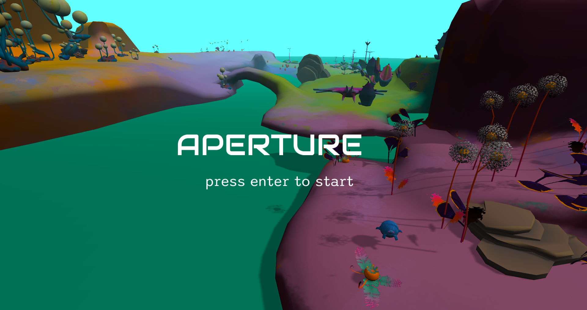

# Aperture
Developed by Joyce Zhang, Scott King, and Will Ozeas for 15-466 at CMU. 

## Controls
- Move: WASD
- Crouch: lctrl
- Open/Close Journal: tab
- Use Camera: right click

### Camera Controls
- Take Picture: left click
- Put Camera Away: right click
- Zoom: mouse wheel
- Adjust focus: mouse wheel + left shift
- Reset: R

## Attributions
- "Audiowide" by Astigmatic  
	(https://fonts.google.com/specimen/Audiowide) is licensed under the Open Font License
- "Poor Story" by Yoon Design  
	(https://fonts.google.com/specimen/Poor+Story) is licensed under the Open Font License
- "Sono" by Tyler Finck  
	(https://fonts.google.com/specimen/Sono) is licensed under the Open Font License
- "Libre Barcode 128 Text" by Lasse Fister  
	(https://fonts.google.com/specimen/Libre+Barcode+128+Text) is licensed under the Open Font License
- "Blank Vintage Book" sprite by Vixen525  
	(https://www.deviantart.com/vixen525/art/Blank-Vintage-Book-362830364)

Built with [NEST](NEST.md) and based on https://github.com/15-466/15-466-f22-base5 and https://github.com/15-466/15-466-f19-base6 by Jim McCann and 15-466's course staff

Original source code for Aperture by Joyce Zhang, Scott King, and Will Ozeas provided with the MIT licenses; code taken from other sources may be licensed differently.
